# การแจกแจงรายได้ของประชากรในประเทศไทยปี 2564

*กฤตพัฒน์ รัตนภูผา, Kittapat Ratanaphupha*

**หมายเหตุ** การทำงานนี้เป็นเพียงการจัดทำเพื่อการศึกษาซึ่งไม่มีพันธะทางวิชาการใด ๆ ทั้งสิ้น (แปลว่า ทำเล่น) หากผู้ใดต้องการใช้ในการอ้างอิง โปรดระมัดระวังในการใช้/ตีความข้อมูลและตรวจสอบกับผู้เชี่ยวชาญด้านเศรษฐศาสตร์สาธารณะเพิ่มเติม

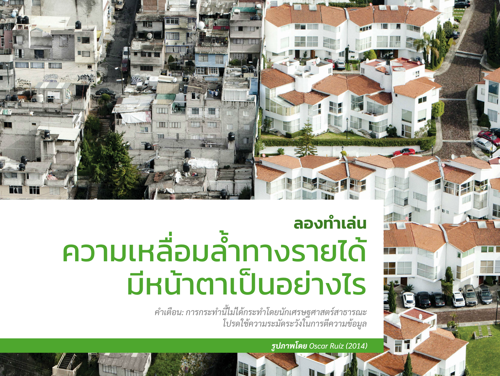

ทั้งนี้ source code สามารถตรวจสอบได้ที่ `pareto.ipynb` ได้เลย

# บทเบื้องต้น

ความเหลื่อมล้ำทางเศรษฐกิจสามารถดูได้จากหลายปัจจัย ซึ่งประกอบด้วยความเหลื่อมล้ำทางรายได้ (income inequality) ความเหลื่อมล้ำทางความมั่งคั่ง (wealth inequality) และความเหลื่อมล้ำทางการบริโภค (consumption inequality) ซึ่งทั้งสามปัจจัยนี้ไม่สามารถทำการค้นหาเจอได้โดยง่าย เพราะการรู้ถึงความเหลื่อมล้ำจะต้องรู้เกี่ยวกับการแจกแจงของแต่ละ variable ให้ชัดเจนระดับหนึ่งก่อน

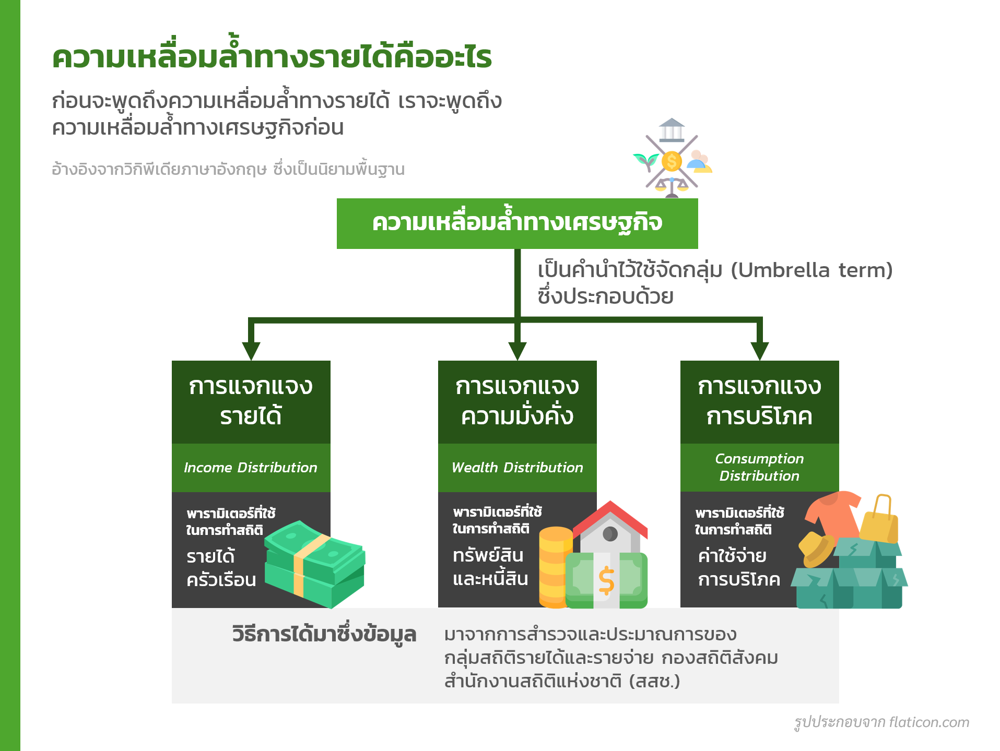

สิ่งที่รัฐบาลทำ (อ้างอิงจากรัฐบาลไทย) คือ การจัดทำเป็นแบบสถิติ โดยรัฐบาลจะทำการเก็บแบบสอบถามดังต่อไปนี้

1. โครงการสำรวจข้อมูลพื้นฐานของครัวเรือน (หรือเรียกว่า สพค.)
2. โครงการสำรวจภาวะการทำงานของประชากร (หรือเรียกว่า สรง.)
3. การสำรวจภาวะเศรษฐกิจและสังคมของครัวเรือน (หรือเรียกว่า สศส.) 

การสอบถามนั้นจะมิได้เป็นการเก็บข้อมูลทุกหลัง เนื่องจากเสียงบประมาณแผ่นดินเป็นจำนวนมากเกินความจำเป็น การสำรวจบางกลุ่มโดยใช้การชักตัวอย่างแบบสุ่มจึงเป็นการสำรวจที่เพียงพอเพื่อพันธกิจของรัฐแล้ว

อ้างอิงจากสำนักงานสถิติแห่งชาติ 

1. การสำรวจจะใช้สุ่มโดยวิธี stratified two-stage sampling ซึ่งหมายถึงการสุ่มสองขั้น คือ 
  
    1.1. การสุ่มเขตแจงนับ (enumerating area: EA) ซึ่งมีทั้งหมด 139,325 EAs (โดยคำนึงถึงจำนวนครัวเรือนและชนิดของชุมชนว่าเป็นชุมชนในเทศบาลหรือนอกเทศบาล) โดยสุ่มออกมา 3,600 EAs ซึ่งใช้โปรแกรมสุ่มของสำนักงานฯ ในการสุ่ม
    
    1.2. แต่ละ EA จะเลือกสุ่ม 16 ครัวเรือนในการจัดทำ (ทั้งสิ้น 57,600 ครัวเรือน) และแบ่งสุ่มเป็น 12 batches (สำรวจเดือนละ 1 batch) เพื่อลด effect เกี่ยวกับเวลาในช่วงปี

2. ลงพื้นที่สำรวจทีละ batch โดยสำรวจ สศส. นั้นจะแบ่งออกเป็น สศส. 2 (พิเศษ) ซึ่งสำรวจเกี่ยวกับสมาชิกและรายจ่ายของครัวเรือน และ สศส. 3 ซึ่งสำรวจเกี่ยวกับรายได้ของครัวเรือน โดยแยกออกมาเป็นประเภทรายได้รายคน

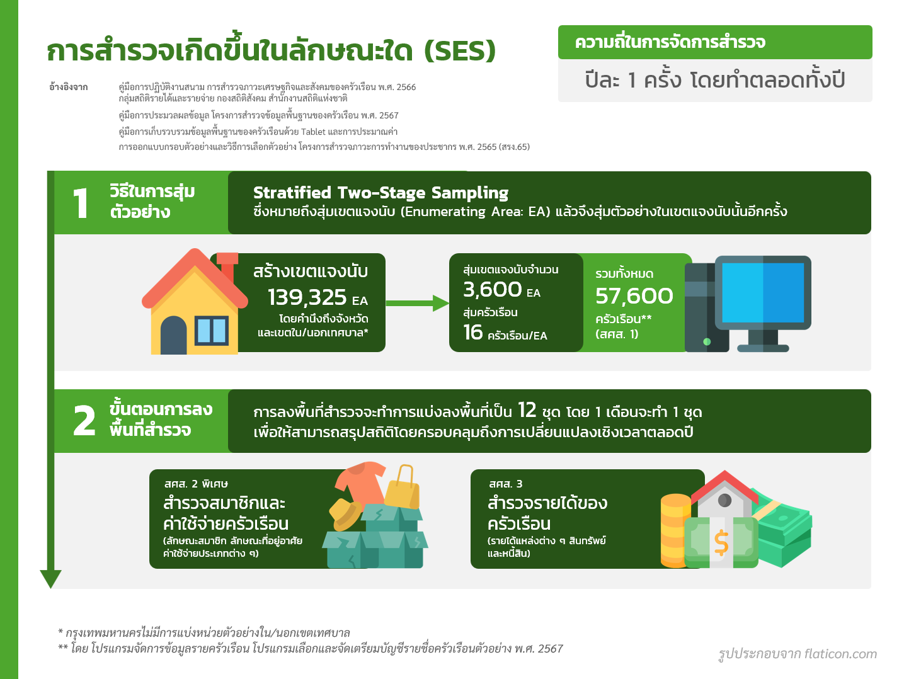

### อ้างอิง

- (นิยามของความเหลื่อมล้ำ) https://en.wikipedia.org/wiki/Economic_inequality
- (คู่มือการประมวลผลข้อมูล โครงการสำรวจข้อมูลพื้นฐานของครัวเรือน พ.ศ. 2567) https://uttaradit.nso.go.th/images/Thiwanon/PDF_File/Mannual/2567/FDHS-COM-2567.pdf
- (คู่มือการปฏิบัติงานสนาม การสำรวจภาวะเศรษฐกิจและสังคมของครัวเรือน พ.ศ. 2566 
) http://www.oic.go.th/FILEWEB/CABINFOCENTER3/DRAWER071/GENERAL/DATA0002/00002005.PDF
- (คู่มือการเก็บรวบรวมข้อมูลพื้นฐานของครัวเรือนด้วย Tablet และการประมาณค่าการออกแบบกรอบตัวอย่างและวิธีการเลือกตัวอย่าง โครงการสำรวจภาวะการทำงานของประชากร พ.ศ. 2565 (สรง.65)
) http://www.oic.go.th/FILEWEB/CABINFOCENTER2/DRAWER076/GENERAL/DATA0000/00000199.PDF

# ความเหลื่อมล้ำคำนวณอย่างไร

ดัชนีตัวหนึ่งสำหรับการวัดความเหลื่อมล้ำของ variable $X$ ที่เป็น interval scale เรียกว่า Gini ซึ่ง Gini ของ $P(X)$ สามารถคำนวณได้ว่า

$$\mathrm{Gini}_X = 1-2\int_0^1\mathrm{Lorenz}(x)\,dx$$

โดย $\mathrm{Lorenz}: [0,1] \to [0,1]$ นิยามได้ว่า

$$\mathrm{Lorenz}_X(x) = \begin{cases}
    0 & x = 0\\
    \frac{\sum_{m=1}^k I_m}{\sum_{j=1}^n I_j}&x = \frac kn \text{ for some } k \in \{1, \dots, n\}\\
    \mathrm{Lorenz}_X\left(\frac kn\right)&\lfloor nx \rfloor = k
\end{cases}$$

ซึ่งค่า Gini จะมีได้ตั้งแต่ $[0,1]$ โดยหากว่า
- Gini เป็น 0 จะเปรียบเสมือนว่าประชากรมีการแจกแจงเดียวกัน (ในกรณีของรายได้ หมายถึง ทุกคนมีรายได้เท่ากัน)
- Gini เป็น 1 จะเปรียบเสมือนว่าประชากรทุกคนมี $X = 0$ แต่มีเพียง 1 คนที่ $X \neq 0$ (ในกรณีของรายได้ หมายถึง มีเพียงคนเดียวในประเทศเท่านั้นที่มีรายได้)

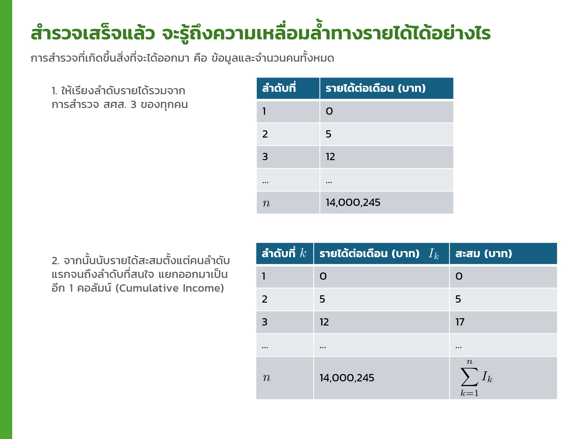
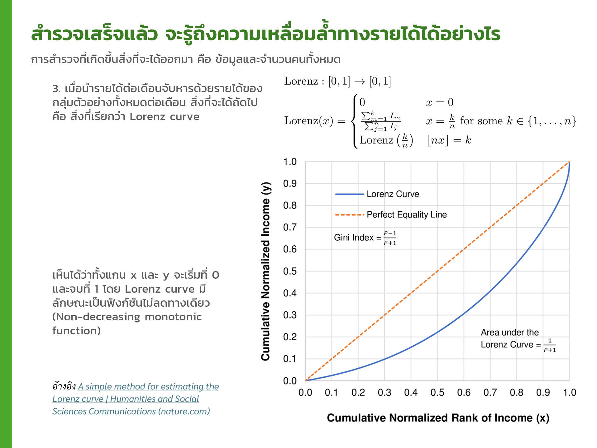
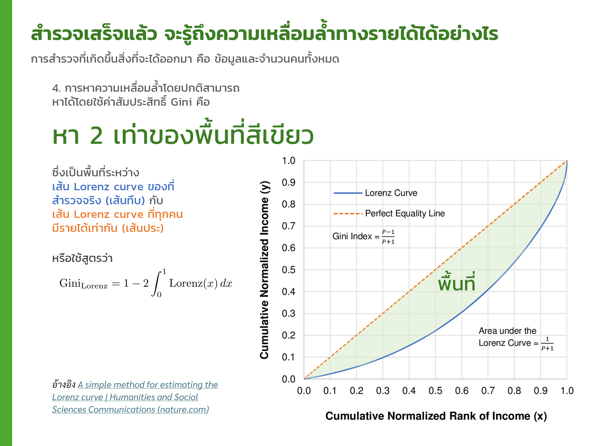

### อ้างอิง

- (ภาพ Lorenz curve) https://www.nature.com/articles/s41599-021-00948-x

# บทประยุกต์กับประเทศไทย

ประเทศไทยนั้นมีข้อมูลเกี่ยวกับรายได้ของประชากรล่าสุดในปี 2564 โดยเป็นการประมวลผลข้อมูลจากสำนักงานสภาพัฒนาเศรษฐกิจและสังคมแห่งชาติ หรือ เรียกว่า "สภาพัฒน์"

## เรารู้อะไรเกี่ยวกับประเทศไทยบ้าง
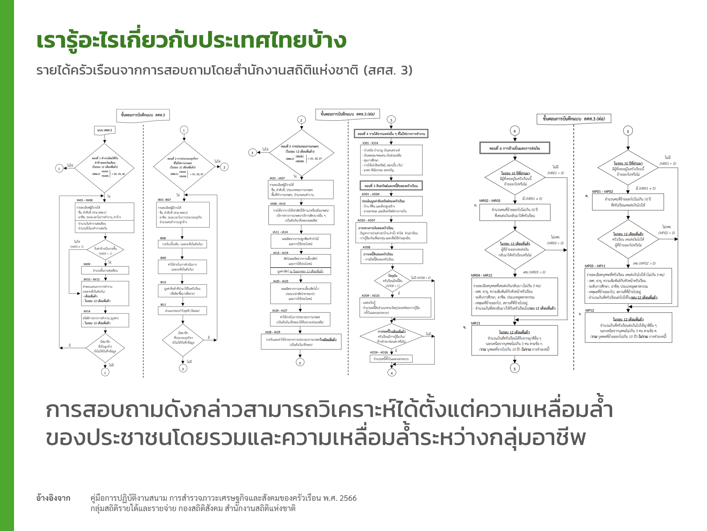
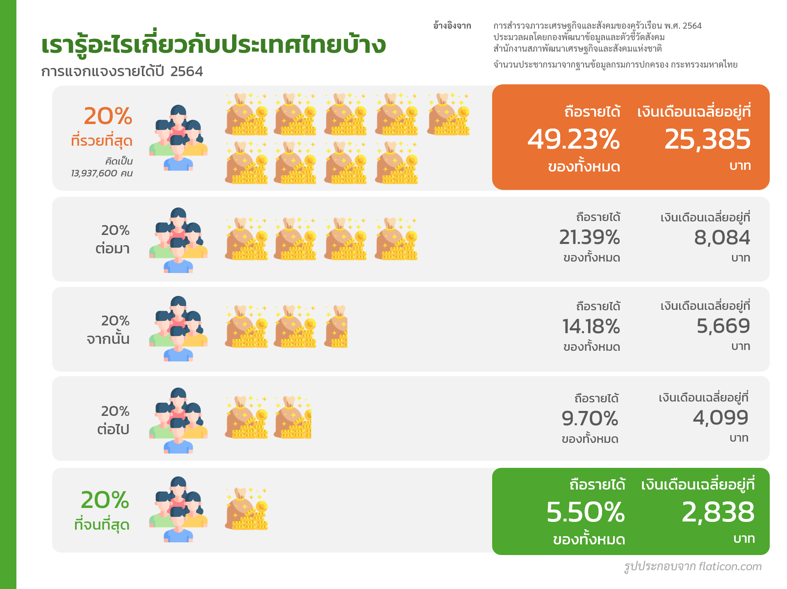

แต่ทว่าเมื่อเราอนุมานว่ารายได้ของประชากรในแต่ละ quintile นั้นกลับให้ค่า Gini ที่ต่ำกว่าที่สภาพัฒน์ประมวลผลไว้ จึงต้องการใช้ข้อมูลเพิ่มเติม

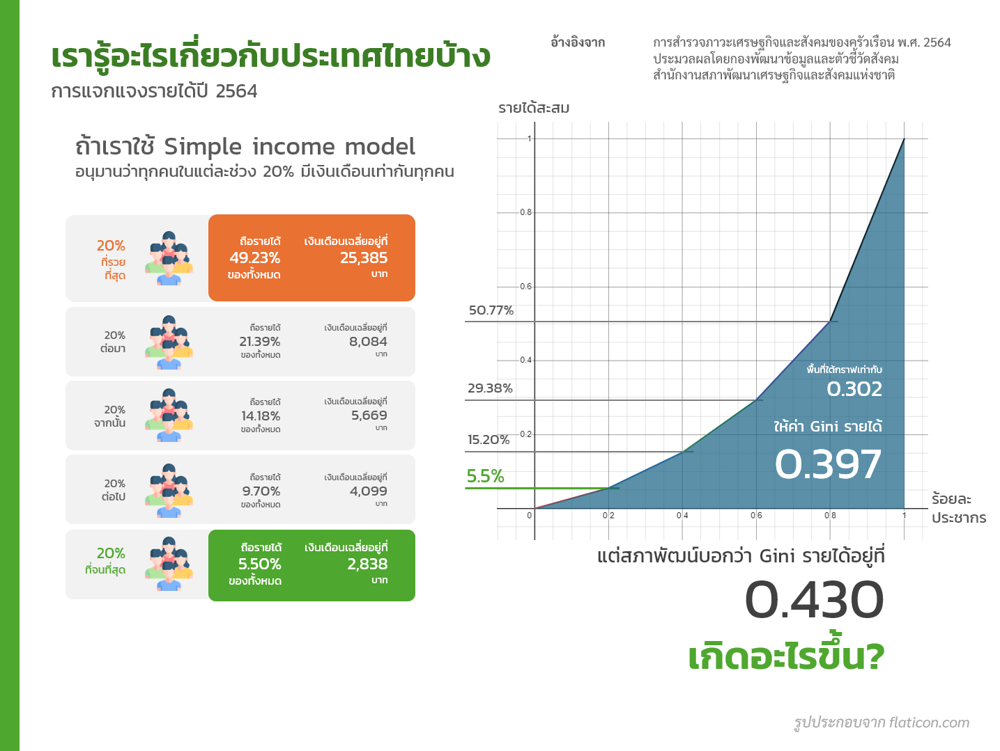

โดยข้อมูลเพิ่มเติมที่เราใช้ คือ ผู้เสียภาษีเงินได้บุคคลธรรมดาจากกรมสรรพากร ซึ่งพบว่าข้อมูลผู้เสียภาษีเงินได้บุคคลธรรมดามีเผยแพร่ล่าสุด (เท่าที่สามารถหาได้) ในปี 2557 ซึ่งทำให้ต้องคำนวณจำนวนผู้เสียภาษีเงินได้บุคคลธรรมดาใหม่อีกครั้งให้สอดคล้องกับ

- เงินเดือนเฉลี่ยตามที่สภาพัฒน์ประมวลผลไว้
- ค่า Gini ตามที่สภาพัฒน์ประมวลผลไว้

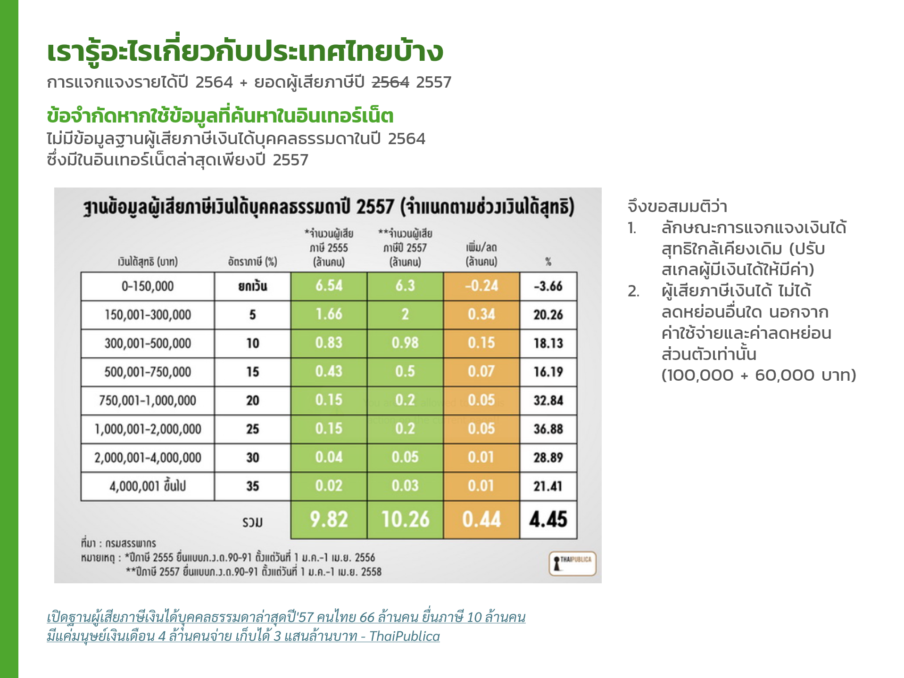

แต่ทั้งนี้ทั้งนั้น การคำนวณเงินได้โดยใช้ผู้เสียภาษีเงินได้จะต้องบวกกับค่าลดหย่อนภาษีต่าง ๆ ที่เกี่ยวข้องออกทั้งหมดก่อน โดยอนุมานว่าทุกคนไม่มีค่าลดหย่อนอื่นใด นอกจากค่าใช้จ่ายที่กรมสรรพากรอนุญาตให้ใช้กับค่าลดหย่อนส่วนตัว ซึ่งรวมกันได้ 60,000 + ร้อยละ 50 ของเงินได้ไม่เกิน 100,000 บาท (ซึ่งผู้เสียภาษีขั้นแรกก็ได้ลดหย่อน 160,000 บาทอยู่แล้ว จึงสามารถคิดเป็นค่าคงที่บวกเข้าไปกับเงินได้สุทธิได้เลย)

## ความเหลื่อมล้ำทางรายได้หน้าตาเป็นอย่างไร

จากงานวิจัยของ Clementi และ Gallegati (2005) พบว่าแบบจำลองรายได้ของประชากรสามารถใช้ log-normal distribution ในการประมาณ ซึ่งครอบคลุมไปถึงร้อยละ 97-99 ของประชากร เราจึงพยายามลองทำแบบจำลองรายได้ให้เป็นไปตาม log-normal distribution

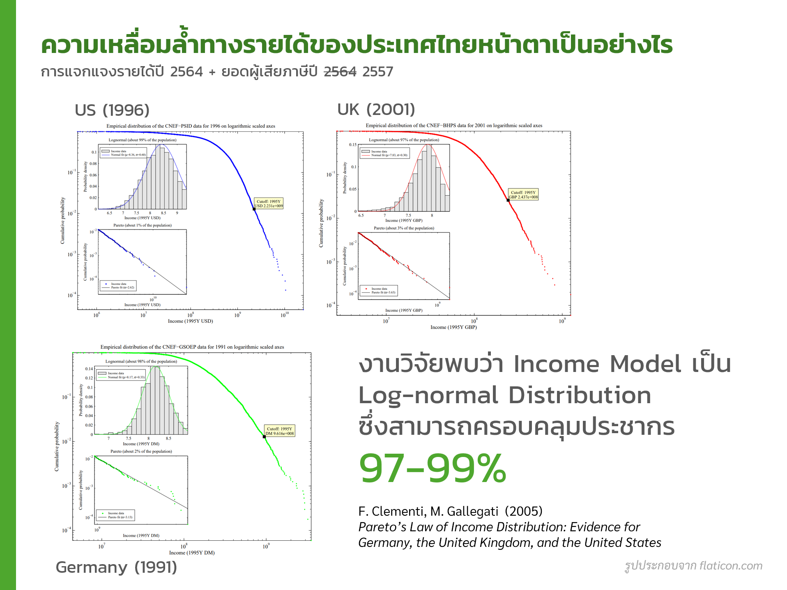

โดยแบบจำลองที่เราใช้ประกอบไปด้วย 2 แบบจำลอง คือ

1. แบบจำลองที่ใช้การ simulate เงินได้แยกแต่ละ quintile และขั้นรายได้เสียภาษี ซึ่งอนุมานเป็น $\mathrm{LogNormal}(\mu_i, \sigma_i^2)$ โดยค่า parameter ทั้ง 12 จะใช้ปรับมือ (ไม่สนใจ $\mu_i$ เพราะไม่มีผลต่อ Gini)
2. แบบจำลองที่ใช้การ simulate เงินได้แยกเป็น quintile 1-4, quintile ที่ 5 และขั้นรายได้เสียภาษี ซึ่งอนุมานเป็น $\mathrm{LogNormal}(\mu_i, \sigma_i^2)$ โดยค่า parameter ทั้ง 9 จะใช้ปรับมือ (ไม่สนใจ $\mu_i$ เพราะไม่มีผลต่อ Gini)

ซึ่งเมื่อปรับมือแล้วให้ได้ว่ามีค่า Gini เท่ากับที่สภาพัฒน์ประมวลได้พอดี คือ 0.430

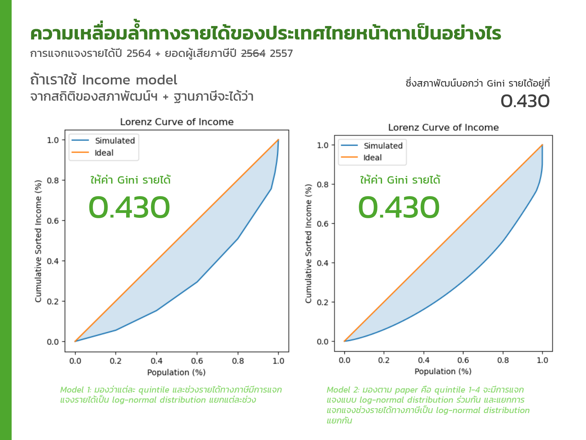

โดยผลลัพธ์ที่ได้มีหน้าตาดังต่อไปนี้

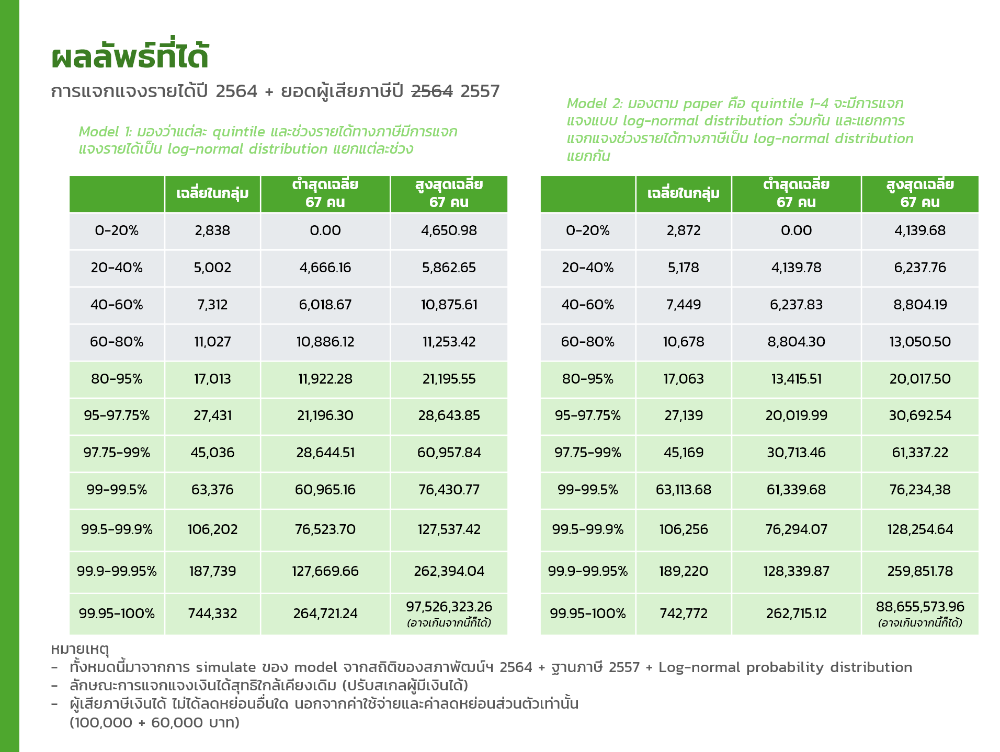

ทั้งนี้เรายังไม่สรุปว่าแบบจำลองแบบใดมีความแม่นยำกว่ากัน เราจะได้ข้อสรุปร่วมกันระหว่าง 2 แบบจำลองดังนี้

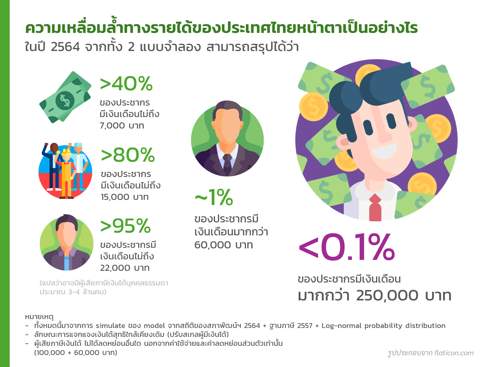

### อ้างอิง

- (ข้อมูลประมวลผลของสภาพัฒน์) https://www.nesdc.go.th/ewt_dl_link.php?nid=3518&filename=PageSocial
- F. Clementi, M. Gallegati  (2005)
Pareto’s Law of Income Distribution: Evidence for Germany, the United Kingdom, and the United States
- (ฐานผู้เสียภาษี) https://thaipublica.org/2016/01/personal-income-tax-structure-29/

# ภาคผนวก

ในหัวข้อนี้ สำหรับผู้วิจัยที่สนใจในการคำนวณแบบจำลองเงินได้อื่น ๆ ต่อไปในอนาคต

## หลักการทำงานของ `pareto.ipynb`

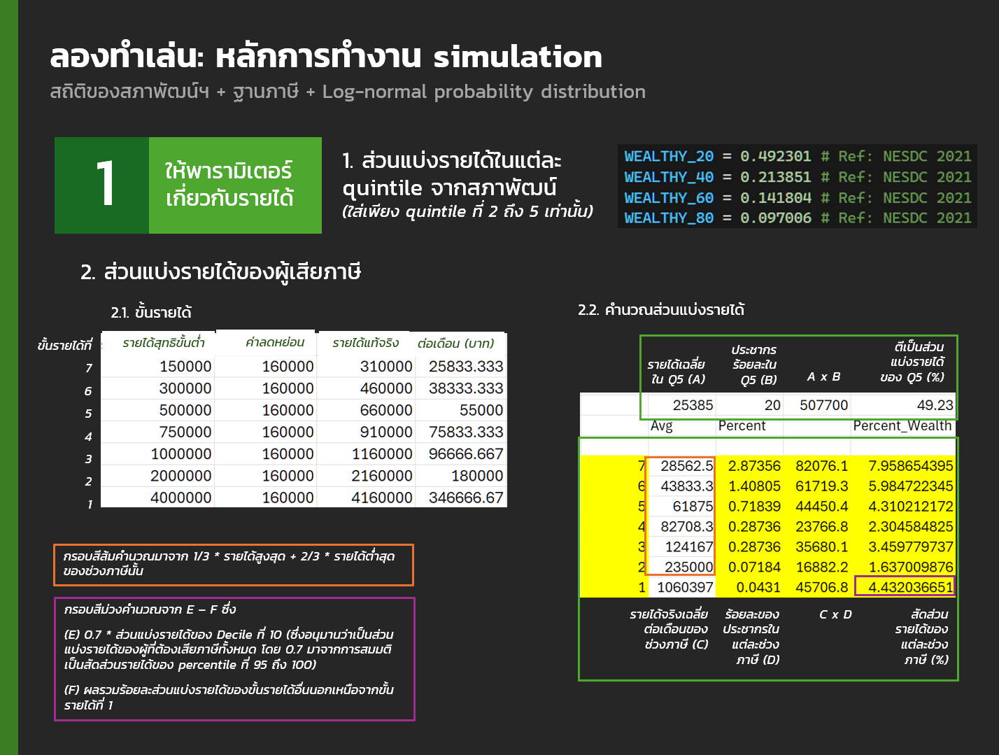
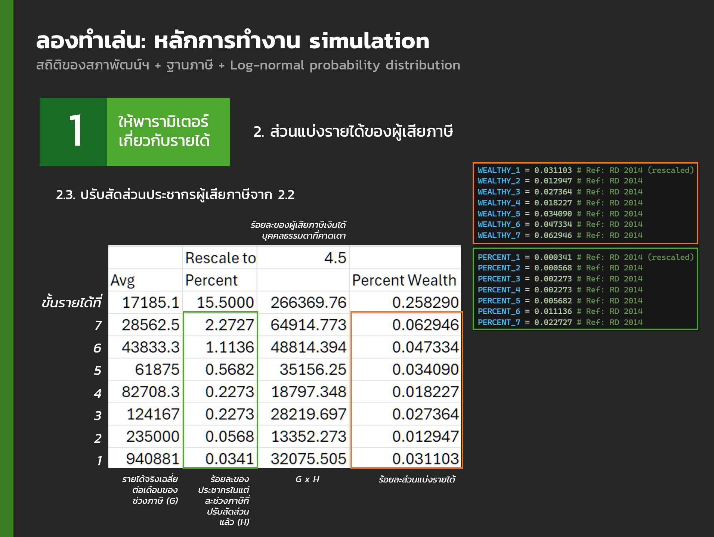

ข้อมูลที่ใช้ในการคำนวณสัดส่วนรายได้ของแต่ละขั้นเงินได้ สามารถดูได้จาก `Gini.xlsx`

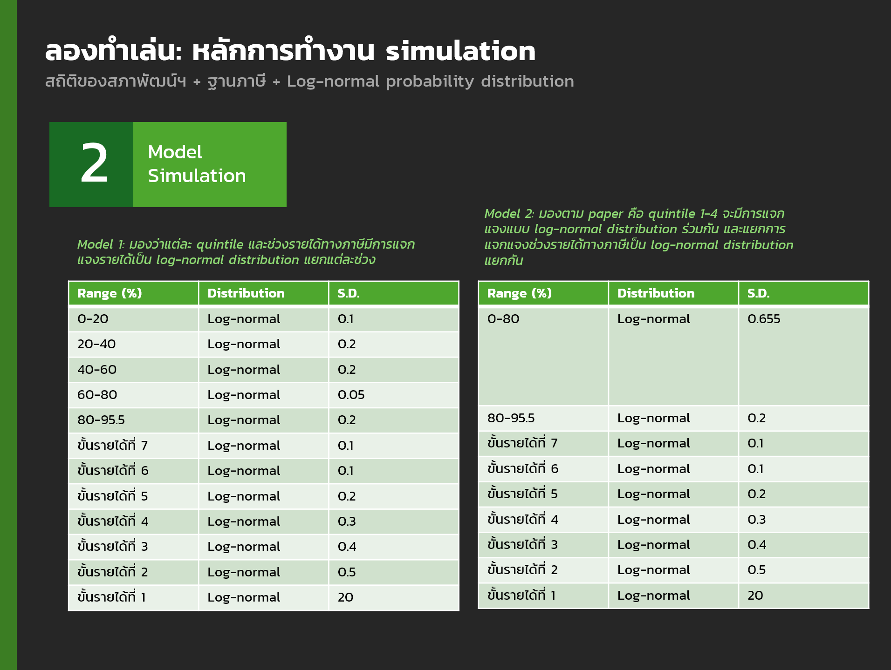

## ข้อสรุปเพิ่มเติมที่เราได้มีดังต่อไปนี้

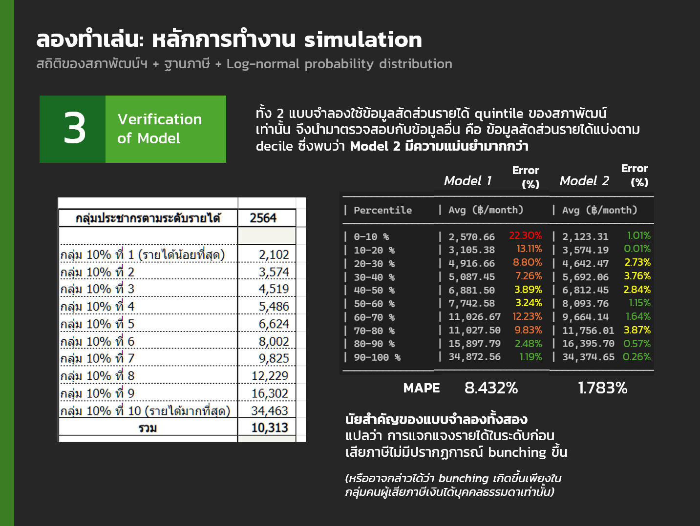

จากข้อมูล เราได้ว่าแบบจำลองทั้งสองสามารถอธิบายเงินได้ ได้มากกว่า 90% โดยเฉพาะอย่างยิ่งแบบจำลองที่ 2 ที่สามารถอธิบายได้ 99% (คำนึงจากค่า MAPE โดยเทียบกับข้อมูลประมวลผลของสภาพัฒน์แบบ decile ซึ่งแบบจำลองใช้ quintile model ในการจำลอง)

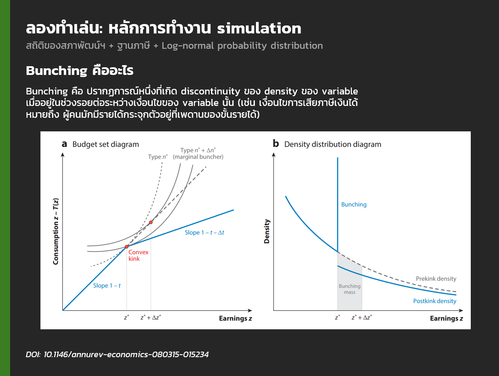

ปรากฏการณ์ bunching ของเงินได้อาจเกิดขึ้นเพียงในรอยต่อระหว่างขั้นรายได้สุทธิสำหรับภาษีเงินได้บุคคลธรรมดาเท่านั้น เพราะจากแบบจำลองทั้งสองสามารถสรุปได้ว่าไม่มีปรากฏการณ์ bunching ในกลุ่มผู้มีรายได้น้อย (quintile 1-4)
